<h2>TensorFlow-FlexUNet-Image-Segmentation-Model (Updated: 2025/07/10)</h2>
<li>2025/06/07: Updated <a href="./projects/TensorFlowFlexUNet/PanNuke/train_eval_infer.config">train_eval_infer.config</a> 
and retrained PanNuke segmetation model.</li> 
<li>2025/06/08: Added <b>rgb_to_categorized_mask</b> converter to <a href="./src/ImageCategorizedMaskDataset.py">ImageCategorizedMaskDataset</a> class</li>
<li>2025/06/09: Updated <a href="./src/EpochChangeInferencer.py">EpochChangeInferencer</a> to support JPG input files. </li>
<li>2025/06/10: Updated <a href="./src/TensorFlowFlexModel.py">TensorFlowFlexModel</a> to support JPG input files. </li>
<li>2025/07/10: Added various TensorFlowFlexUNet models, 
<a href="./src/TensorFlowFlexAttentionUNet.py">TensorFlowFlexAttentionUNet</a>,
<a href="./src/TensorFlowFlexSwinUNet.py">TensorFlowFlexSwinUNet</a>,
and so on. </li>

 
<h2>
<a id="1">
1 TensorFlowFlexUNet Image Segmentation Model
</a>
</h2>
We implemented a set of various <b>TensorFlow Image Segmentation UNet Models for MultiClass</b>, which contains
 the following classes derived from <b><a href="./src/TensorFowFlexUNet.py">TensorFlowFlexUNet</a>.</b>
  
<b> TensorFlow UNet Class Hierarchy </b> 
<pre>
<a href="./src/TensorFlowFlexModel.py">TensorFlowFlexModel</a>
 └─<a href="./src/TensorFowFlexUNet.py">TensorFlowFlexUNet</a>
    ├─ <a href="./src/TesorFlowFlexAttentionUNet.py">TensorFlowFlexAttentionUNet</a>
    ├─ <a href="./src/TensorFlowFlexDeepLabV3Plus.py">TensorFlowFlexDeepLabV3Plus</a>
    ├─ <a href="./src/TensorFlowFlexEfficientNetB7UNet.py">TensorFlowFlexEfficientNetB7UNet</a>
    ├─ <a href="./src/TensorFlowFlexEfficientUNet.py">TensorFlowFlexEfficientUNet</a>
    ├─ <a href="./src/TensorFlowFlexMultiResUNet.py">TensorFlowFlexMultiResUNet</a>
    ├─ <a href="./src/TensorFlowFlexSharpUNet.py">TensorFlowFlexSharpUNet</a>
    ├─ <a href="./src/TensorFlowFlexSwinUNet.py">TensorFlowFlexSwinUNet</a>
    ├─ <a href="./src/TensorFlowFlexTransUNet.py">TensorFlowFlexTransUNet</a>
    ├─ <a href="./src/TensorFlowFlexUNet3Plus.py">TensorFlowFlexUNet3Plus</a>
    └─ <a href="./src/TensorFlowFlexU2Net.py">TensorFlowFlexU2Net</a>
</pre>
  
 
We appreciate all contributors of these various UNet base implementations on the following github repositories. 

<a href="https://github.com/nikhilroxtomar/Semantic-Segmentation-Architecture/blob/main/TensorFlow/attention-unet.py">
https://github.com/nikhilroxtomar/Semantic-Segmentation-Architecture: attention-unet.py</a> 

<a href="https://github.com/TanyaChutani/DeepLabV3Plus-Tf2.x/blob/master/notebook/DeepLab_V3_Plus.ipynb">
https://github.com/TanyaChutani/DeepLabV3Plus-Tf2.x: DeepLab_V3_Plus.ipynb</a> 

<a href="https://github.com/nikhilroxtomar/Semantic-Segmentation-Architecture/blob/main/TensorFlow/multiresunet.py">
https://github.com/nikhilroxtomar/Semantic-Segmentation-Architecture: multiresunet.py</a> 

<a href="https://github.com/hasibzunair/sharp-unets/blob/master/demo.ipynb">
https://github.com/hasibzunair/sharp-unets: demo.ipynb</a> 

<a href="https://github.com/yingkaisha/keras-unet-collection/blob/main/keras_unet_collection/_model_swin_unet_2d.py">
https://github.com/yingkaisha/keras-unet-collection: _model_swin_unet_2d.py </a> 

<a href="https://github.com/yingkaisha/keras-unet-collection/blob/main/keras_unet_collection/_model_transunet_2d.py">
https://github.com/yingkaisha/keras-unet-collection: _model_transunet_2d.py</a> 

<a href="https://github.com/hamidriasat/UNet-3-Plus/blob/unet3p_lits/models/unet3plus_utils.py">
https://github.com/hamidriasat/UNet-3-Plus: unet3plus_utils.py</a> 

<a href="https://github.com/yingkaisha/keras-unet-collection/blob/main/keras_unet_collection/_model_u2net_2d.py">
https://github.com/yingkaisha/keras-unet-collection: _model_u2net_2d.py</a> 
<a href="https://github.com/ahmed-470/Segmentation_EfficientNetB7_Unet/blob/main/efficientnetb7_Unet.py">
https://github.com/ahmed-470/Segmentation_EfficientNetB7_Unet: efficientnetb7_Unet.py</a>
 
 
Please see also our repository <b><a href="https://github.com/sarah-antillia/Tensorflow-Image-Segmentation-API">
Tensorflow-Image-Segmentation-API</a></b>.
 
 
<h2>2. TensorFlowFlexUNet Image Segmentation for PanNuke </h2>
This is the first experiment of Image Segmentation for PanNuke 
 based on 
our <a href="./src/TensorFlowFlexUNet.py">TensorFlowFlexUNet</a>
 (<b>TensorFlow Flexible UNet Image Segmentation Model for Multiclass</b>) and a PNG and NPZ <a href="https://drive.google.com/file/d/1CxG_7CyIBiVqbf0kiNQJtMi3vvqJwTLi/view?usp=sharing">
PanNuke-Mini-ImageMask-Dataset-With-Categorize-Masks.zip</a>, which was derived by us from the 
<a href="https://www.kaggle.com/datasets/andrewmvd/cancer-inst-segmentation-and-classification">
Cancer Instance Segmentation and Classification 1
</a>.
  
On the dataset, please refer to our repository 
<a href="https://github.com/sarah-antillia/RGBMask-To-CategorizedMask-Conversion-Tool">
RGBMask-To-CategorizedMask-Conversion-Tool.</a>
 

<h3>Image Segmentation by TensorFlowFlexUNet</h3>
<b>Actual Image Segmentation for 512x512 PanNuke Dataset</b> 
As shown below, the inferred masks look similar to the ground truth masks.  
<table>
<tr>
<th>Input: image</th>
<th>Mask (ground_truth)</th>
<th>Prediction: inferred_mask</th>
</tr>
<tr>
<td></td>
<td>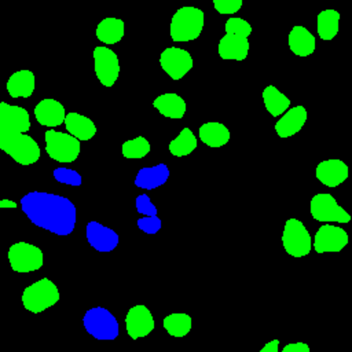</td>
<td>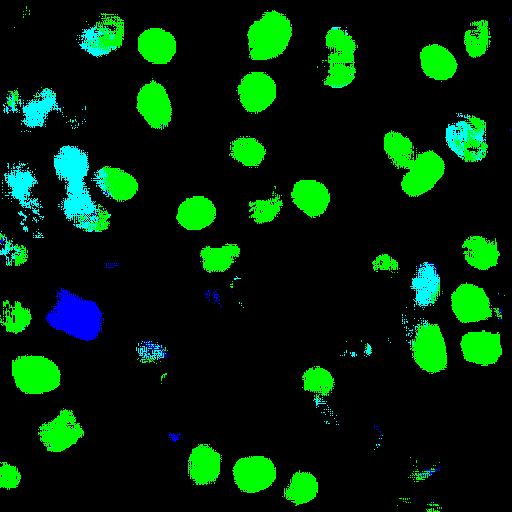</td>
</tr>

<tr>
<td></td>
<td>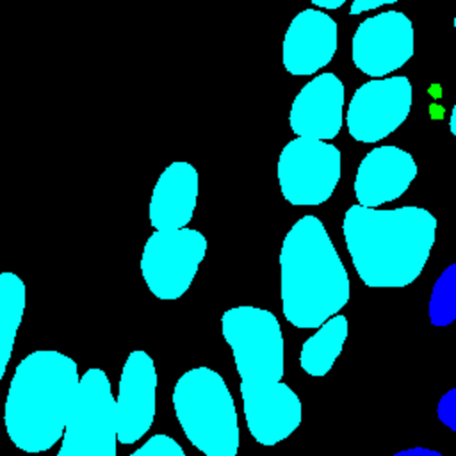</td>
<td>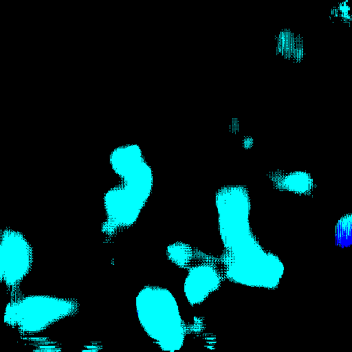</td>
</tr>

<tr>
<td>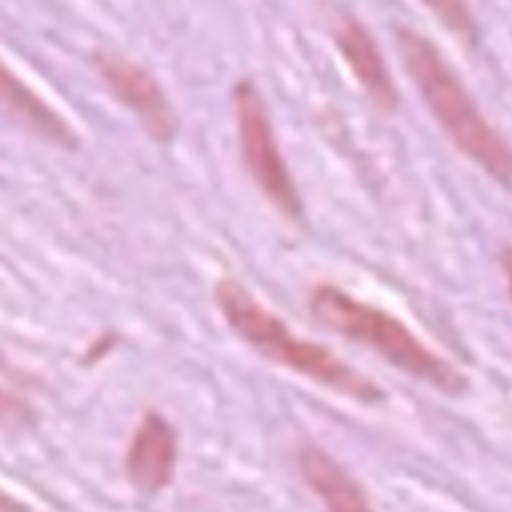</td>
<td></td>
<td></td>
</tr>
</table>

 
<h3>3. Dataset Citation</h3> 
The dataset <a href="https://drive.google.com/file/d/1CxG_7CyIBiVqbf0kiNQJtMi3vvqJwTLi/view?usp=sharing">
PanNuke-Mini-ImageMask-Dataset-With-Categorize-Masks.zip</a>. used here has been taken from. 
https://www.kaggle.com/datasets/andrewmvd/cancer-inst-segmentation-and-classification 
 
<b>About this Dataset</b> 
This dataset, also known as PanNuke, contains semi automatically generated nuclei instance segmentation and  
classification images with exhaustive nuclei labels across 19 different tissue types. The dataset consists  
of 481 visual fields, of which 312 are randomly sampled from more than 20K whole slide images at different  
magnifications, from multiple data sources. 
In total the dataset contains 205,343 labeled nuclei, each with an instance segmentation mask. Models trained  
on PanNuke can aid in whole slide image tissue type segmentation, and generalize to new tissues. 
 
More Medical Imaging Datasets 
Part 1 (current) 
Part 2 
Part 3 
More datasets 
 
<b>Acknowledgements</b> 
If you use this dataset in your research, please credit the authors: 
 
Original Publications 
@article{gamper2020pannuke, 
title={PanNuke Dataset Extension, Insights and Baselines}, 
author={Gamper, Jevgenij and Koohbanani, Navid Alemi and Graham, Simon and Jahanifar, Mostafa and Benet,  
Ksenija and Khurram, Syed Ali and Azam, Ayesha and Hewitt, Katherine and Rajpoot, Nasir}, 
journal={arXiv preprint arXiv:2003.10778}, 
year={2020}  
} 
 
@inproceedings{gamper2019pannuke, 
title={Pannuke: An open pan-cancer histology dataset for nuclei instance segmentation and classification}, 
author={Gamper, Jevgenij and Koohbanani, Navid Alemi and Benet, Ksenija and Khuram, Ali and Rajpoot, Nasir}, 
booktitle={European Congress on Digital Pathology}, 
pages={11--19}, 
year={2019}, 
organization={Springer} 
} 
 
Hovernet formated files were provided by chandlertimm with the available code here. 
 
<b>License</b>
CC BY NC SA 4.0 
 
Splash Image 
Image by Otis Brawley released as public domain by National Cancer Institute, available 
<a href="https://commons.wikimedia.org/wiki/File:Prostate_cancer_(1).jpg">here</a> 
 

 
<h3>4. PanNuke ImageMask Dataset</h3>
 If you would like to train this PanNuke Segmentation model by yourself,
 please download the dataset from the google drive  
<a href="https://drive.google.com/file/d/1CxG_7CyIBiVqbf0kiNQJtMi3vvqJwTLi/view?usp=sharing">
PanNuke-Mini-ImageMask-Dataset-With-Categorize-Masks.zip</a>.
 
, expand the downloaded ImageMaskDataset and put it under <b>./dataset</b> folder to be
<pre>
./dataset
└─PanNuke-TINY
    ├─test
    │   ├─cmasks
    │   ├─images
    │   └─masks
    ├─train
    │   ├─cmasks
    │   ├─images
    │   └─masks
    └─valid
        ├─cmasks
        ├─images
        └─masks
</pre>
 
Please rename <b>categorized_masks</b> in <b>test</b>, <b>train</b> and <b>valid</b> folders
in the downloaded dataset to <b>cmasks</b>. 
On the derivation of this dataset, please refer to 
<a href="https://github.com/sarah-antillia/RGBMask-To-CategorizedMask-Conversion-Tool">
RGBMask-To-CategorizedMask-Conversion-Tool</a>.
 

 
<b>PanNuke Statistics</b> 
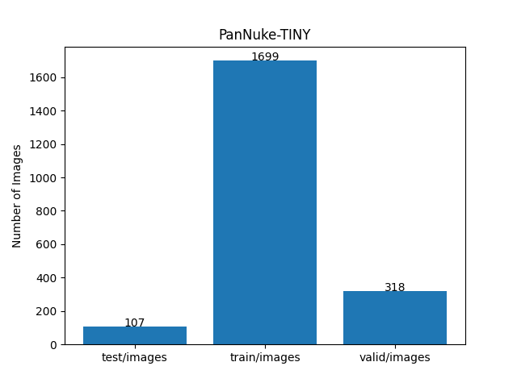 
 
As shown above, the number of images of train and valid datasets is not so large, but enough 
to use for a training set of our segmentation model.
 
 
<b>Train_images_sample</b> 
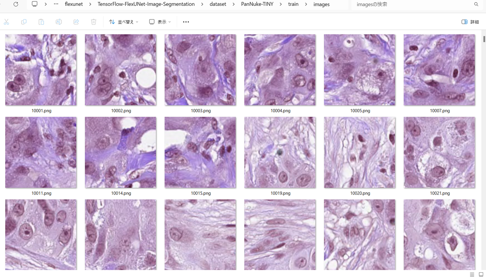
 
<b>Train_masks_sample</b> 
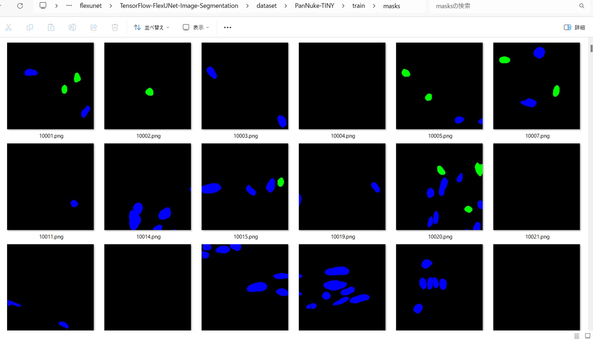
 

<h3>5. Train TensorFlowFlexUNet Model</h3>
 We trained PanNuke TensorFlowFlexUNet Model by using the following
<a href="./projects/TensorFlowFlexUNet/PanNuke/train_eval_infer.config"> <b>train_eval_infer.config</b></a> file.  
Please move to ./projects/TensorFlowFlexUNet/PanNuke and run the following bat file. 
<pre>
>1.train.bat
</pre>
, which simply runs the following command. 
<pre>
>python ../../../src/TensorFlowFlexUNetTrainer.py ./train_eval_infer.config
</pre>

<b>Model parameters</b> 
Defined a small <b>base_filters = 16 </b> and large <b>base_kernels = (9,9)</b> for the first Conv Layer of Encoder Block of 
<a href="./src/TensorFlowFlexUNet.py">TensorFlowFlexUNet.py</a> 
and a large num_layers (including a bridge between Encoder and Decoder Blocks).
<pre>
[model]
;You may specify your own UNet class derived from our TensorFlowFlexModel
model         = "TensorFlowFlexUNet"
generator     =  False
image_width    = 512
image_height   = 512
image_channels = 3
num_classes    = 6

base_filters   = 16
base_kernels   = (9,9)
num_layers     = 8
dropout_rate   = 0.04
dilation       = (3,3)
</pre>
<b>Learning rate</b> 
Defined a small learning rate.  
<pre>
[model]
learning_rate  = 0.00008
</pre>
<b>Loss and metrics functions</b> 
Specified "categorical_crossentropy" and <a href="./src/dice_coef_multiclass.py">"dice_coef_multiclass"</a>. 
<pre>
[model]
loss           = "categorical_crossentropy"
metrics        = ["dice_coef_multiclass"]
</pre>
<b>Dataset class</b> 
Specifed <a href="./src/ImageCategorizedMaskDataset.py">ImageCategorizedMaskDataset</a> class. 
<pre>
[dataset]
class_name    = "ImageCategorizedMaskDataset"
</pre>
 
<b>Learning rate reducer callback</b> 
Enabled learing_rate_reducer callback, and a small reducer_patience.
<pre> 
[train]
learning_rate_reducer = True
reducer_factor     = 0.4
reducer_patience   = 4
</pre>
<b>Early stopping callback</b> 
Enabled early stopping callback with patience parameter.
<pre>
[train]
patience      = 10
</pre>

<b>RGB Color map</b> 
Specifed mask NumPy NPZ <i>.npz</i> for categorized mask file format, and
rgb color map dict for PanNuke 6 classes. 
<pre>
[mask]
mask_file_format = ".npz"
;PanNuke rgb color map dict for 6 classes.
rgb_map = {(0,0,0):0,(0,255,0):1,(255,0,0):2,(0,0,255):3,(255,255,0):4,(0,255,255):5,}
</pre>

<b>Epoch change inference callback</b> 
Enabled <a href="./src/EpochChangeInferencer.py">epoch_change_infer callback</a></b>. 
<pre>
[train]
epoch_change_infer       = True
epoch_change_infer_dir   =  "./epoch_change_infer"
num_infer_images         = 6
</pre>

By using this callback, on every epoch_change, the inference procedure can be called
 for 6 images in <b>mini_test</b> folder. This will help you confirm how the predicted mask changes 
 at each epoch during your training process.    

<b>Epoch_change_inference output at starting (epoch 1,2,3)</b> 
 
 
<b>Epoch_change_inference output at ending (epoch 45,46,47)</b> 
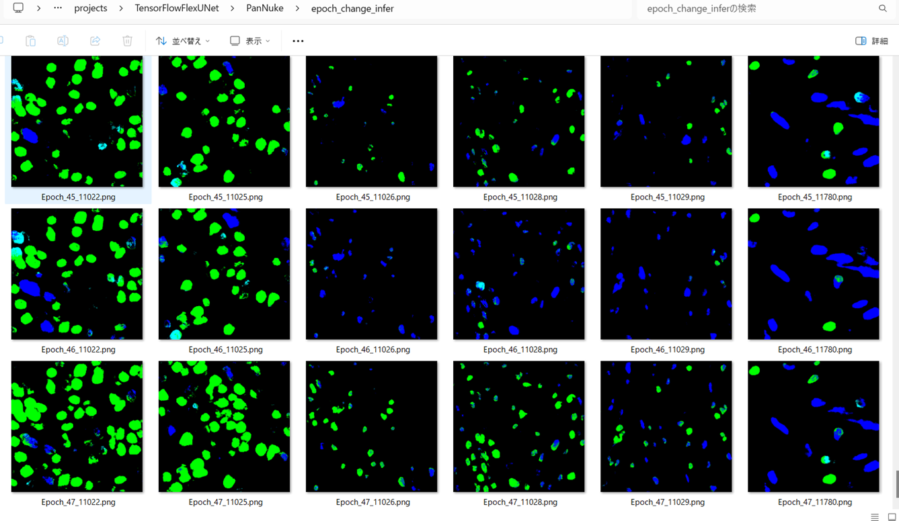 
 

In this experiment, the training process was stopped at epoch 47 by EarlyStopping callback.  
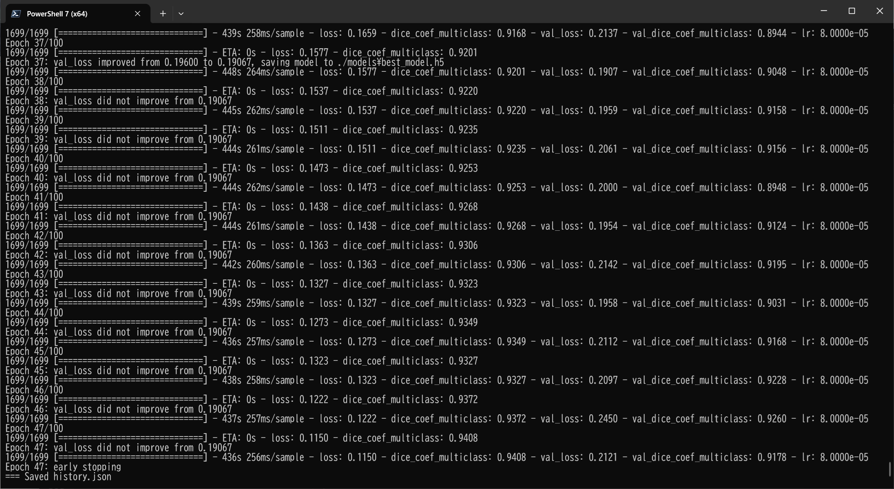 
 

<a href="./projects/TensorFlowFlexUNet/PanNuke/eval/train_metrics.csv">train_metrics.csv</a> 
 

 
<a href="./projects/TensorFlowFlexUNet/PanNuke/eval/train_losses.csv">train_losses.csv</a> 
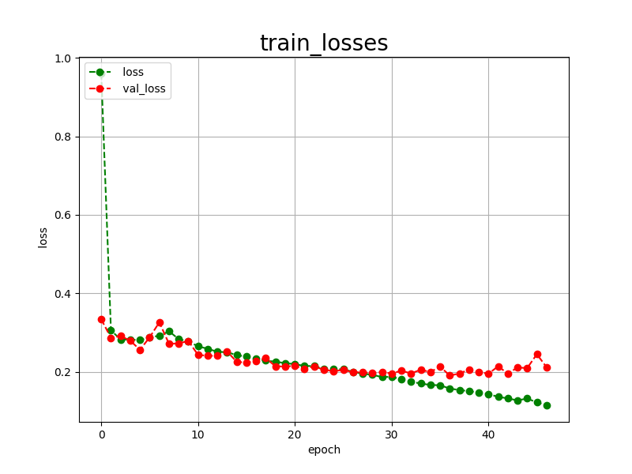 

 

<h3>6. Evaluation</h3>
Please move to <b>./projects/TensorFlowFlexUNet/PanNuke</b> folder, 
and run the following bat file to evaluate TensorFlowUNet model for PanNuke. 
<pre>
./2.evaluate.bat
</pre>
This bat file simply runs the following command.
<pre>
python ../../../src/TensorFlowFlexUNetEvaluator.py ./train_eval_infer_aug.config
</pre>

Evaluation console output: 
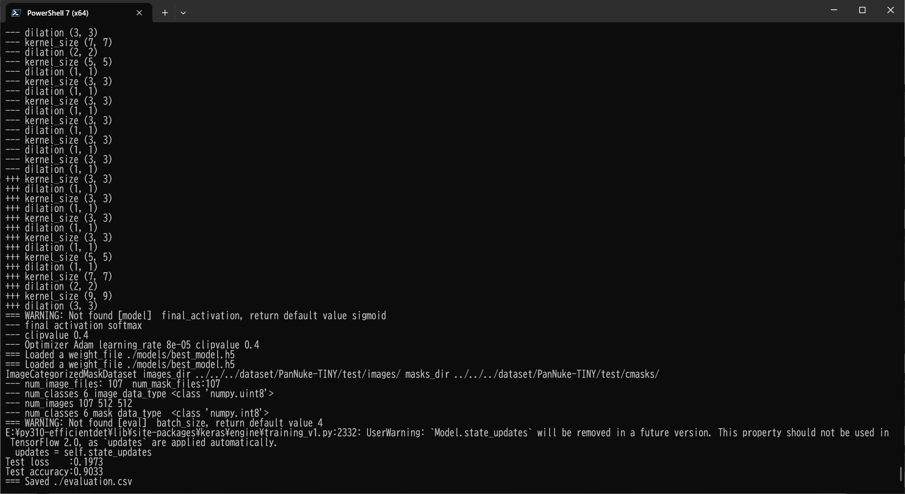
  Image-Segmentation-PanNuke

<a href="./projects/TensorFlowFlexUNet/PanNuke/evaluation.csv">evaluation.csv</a> 
The loss (categorical_crossentropy) to this PanNuke/test was not so low and dice_coef_multiclass 
was relatively high as shown below.
 
<pre>
categorical_crossentropy,0.1973
dice_coef_multiclass,0.9033
</pre>
 

<h3>7. Inference</h3>
Please move to a <b>./projects/TensorFlowFlexUNet/PanNuke</b> folder 
,and run the following bat file to infer segmentation regions for images by the Trained-TensorFlowUNet model for PanNuke. 
<pre>
./3.infer.bat
</pre>
This simply runs the following command.
<pre>
python ../../../src/TensorFlowFlexUNetInferencer.py ./train_eval_infer_aug.config
</pre>

<b>mini_test_images</b> 
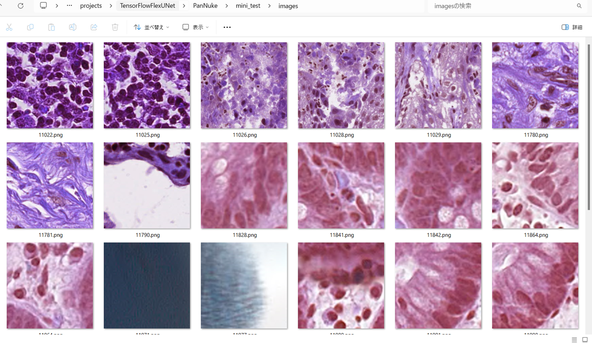 
<b>mini_test_mask(ground_truth)</b> 
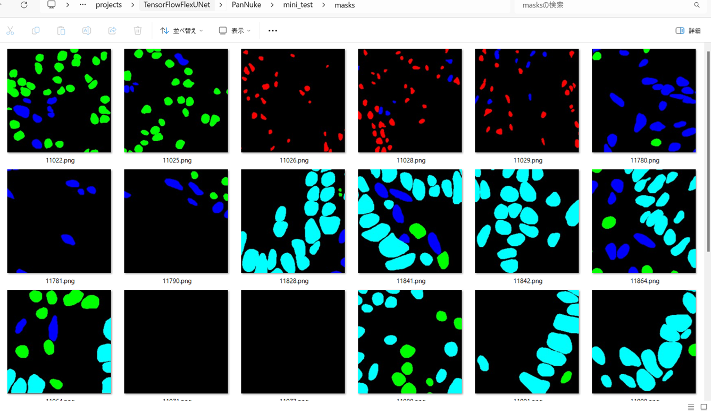 

<b>Inferred test masks</b> 
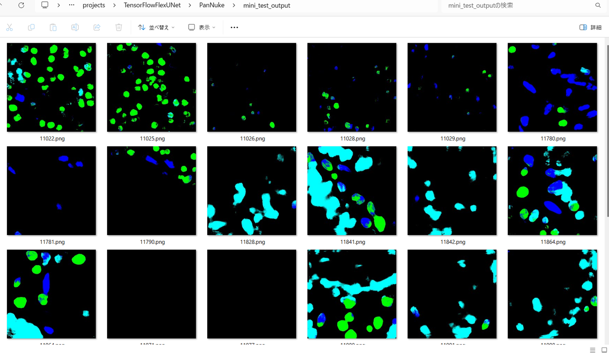 
 

<b>Enlarged images and masks of 512x512 pixels</b> 

<table>
<tr>
<th>Image</th>
<th>Mask (ground_truth)</th>
<th>Inferred-mask</th>
</tr>

<tr>
<td></td>
<td>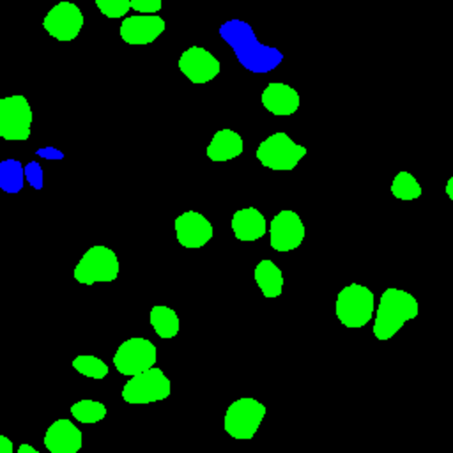</td>
<td>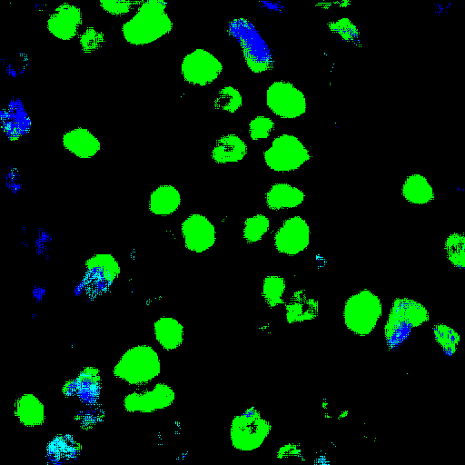</td>
</tr>

<tr>
<td>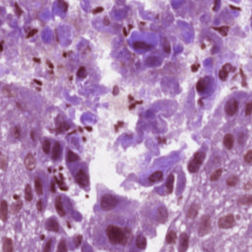</td>
<td>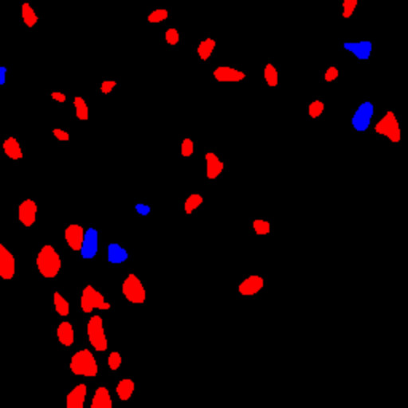</td>
<td>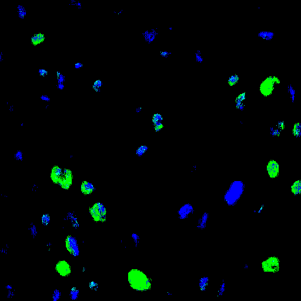</td>
</tr>

<tr>
<td>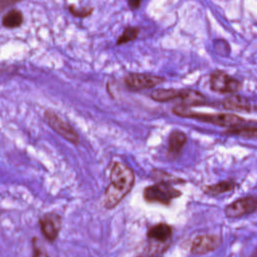</td>
<td>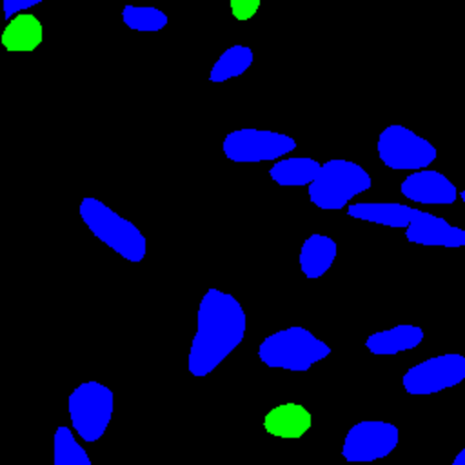</td>
<td>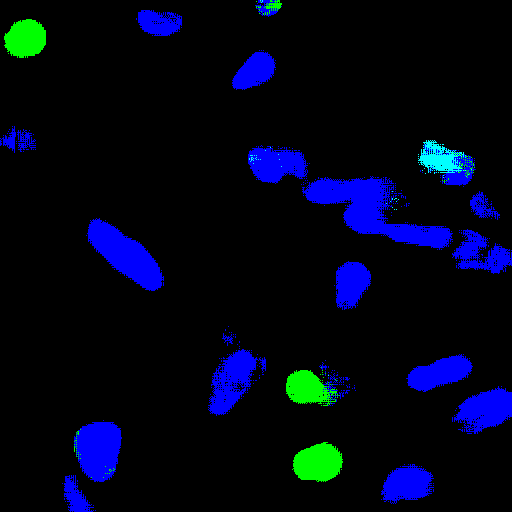</td>
</tr>

<tr>
<td></td>
<td></td>
<td>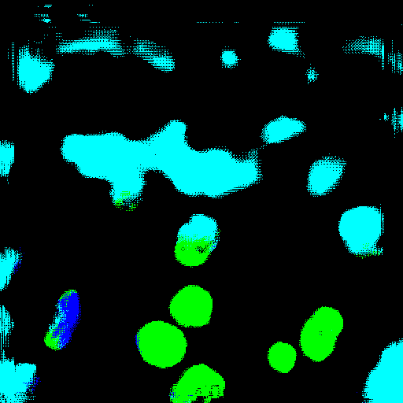</td>
</tr>

<tr>
<td></td>
<td>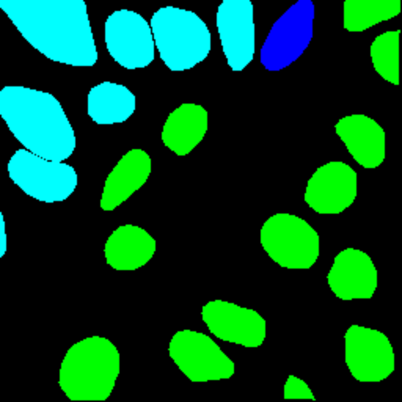</td>
<td>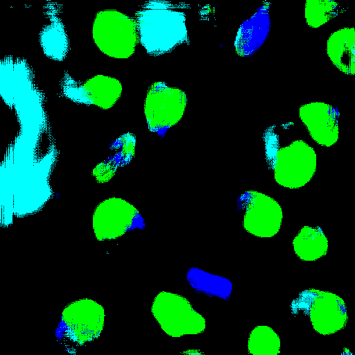</td>
</tr>

<tr>
<td>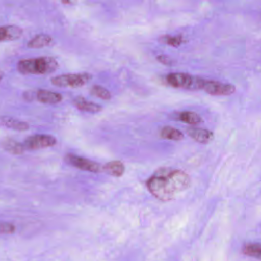</td>
<td></td>
<td>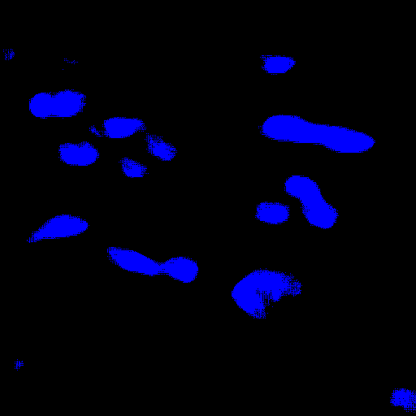</td>
</tr>

</table>

 

<h3>
References
</h3>
<b>1. PanNuke: An Open Pan-Cancer Histology Dataset for Nuclei Instance Segmentation and Classification</b> 
Gamper, Jevgenij and Koohbanani, Navid Alemi and Benet, Ksenija and Khuram, Ali and Rajpoot, Nasir 
<a href="https://academictorrents.com/details/99f2c7b57b95500711e33f2ee4d14c9fd7c7366c">
https://academictorrents.com/details/99f2c7b57b95500711e33f2ee4d14c9fd7c7366c</a>
 
 
<b>2. ImageMask-Dataset-PanNuke</b> 
Toshiyuki Arai @antillia.com 
<a href="https://github.com/sarah-antillia/ImageMask-Dataset-PanNuke">
https://github.com/sarah-antillia/ImageMask-Dataset-PanNuke
</a>
 
 
<b>3. RGBMask-To-CategorizedMask-Conversion-Tool</b> 
Toshiyuki Arai @antillia.com 
<a href="https://github.com/sarah-antillia/RGBMask-To-CategorizedMask-Conversion-Tool">
https://github.com/sarah-antillia/RGBMask-To-CategorizedMask-Conversion-Tool</a>
 
 
<b>5. Tensorflow-Image-Segmentation-API</b> 
Toshiyuki Arai @antillia.com 
<a href="https://github.com/sarah-antillia/Tensorflow-Image-Segmentation-API">
https://github.com/sarah-antillia/Tensorflow-Image-Segmentation-API
</a>

